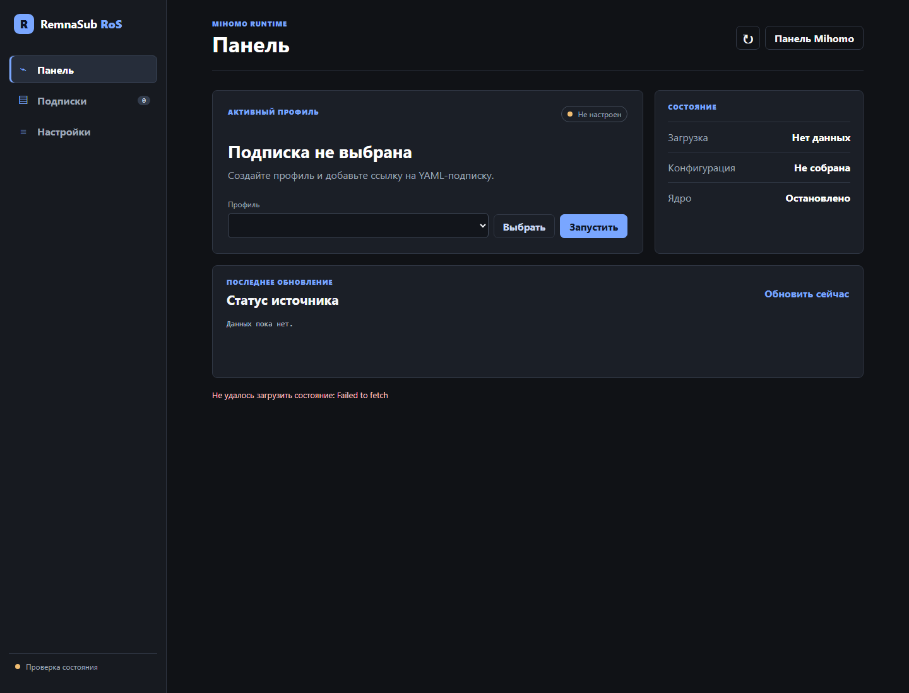

[English](/README.md) | [Русский](/README_RU.md) · [Telegram](https://t.me/+96HVPF3Ww6o3YTNi)

# mihomo-remnasub-ros

> Легковесный мультиархитектурный контейнер для **MikroTik RouterOS**, который получает полные YAML-подписки Remnawave, безопасно применяет локальные переопределения и запускает их в [mihomo](https://github.com/MetaCubeX/mihomo). Управление подписками и контейнером выполняется во встроенной веб-панели на чистом BusyBox `httpd` + sh CGI.

[](https://hub.docker.com/r/medium1992/mihomo-remnasub-ros)
[](https://hub.docker.com/r/medium1992/mihomo-remnasub-ros)
[](./LICENSE)

[](https://t.me/+96HVPF3Ww6o3YTNi)

<p align="center"></p>

## ✨ Возможности

- 📚 **Несколько YAML-подписок**: выбор активной, ручное и периодическое обновление, отдельные настройки каждого профиля.
- 📄 Подписка используется как **полный конфиг mihomo**, а не как `proxy-provider`.
- 🧾 Обязательные и произвольные **HTTP-заголовки Remnawave**, плюс локальные заголовки для отдельных подписок.
- 🧩 Глобальные и локальные переопределения Mihomo: listeners, контроллер, UI, `find-process-mode`, `log-level`, IPv6, profile и sniffer.
- 🔀 Режимы перехвата **REDIR + TPROXY**, **REDIR + TUN** и **TPROXY** с автоматическим выбором по возможностям ядра RouterOS.
- ✅ Перед переключением выполняется `mihomo -t`; неисправная новая конфигурация не заменяет уже работающую.
- 🖥 Встроенная панель подписок на порту `80` и загружаемая панель самого Mihomo на порту `9090`.
- 🔐 HTTP Basic Auth по md5crypt-хешу; генератор `BASIC_AUTH_HASH` находится в веб-панели.
- 💾 Профили сохраняются в `/etc/mihomo`, а рабочие YAML, задания и журнал создаются в `/dev/shm`.
- 🌍 Сборки для amd64, arm64, armv7 и armv5.

## 🚦 Как это работает

1. Пользователь добавляет URL полной YAML-подписки. При сохранении нового или изменённого URL загрузка начинается автоматически.
2. Контейнер отправляет общие заголовки Remnawave и, если включено, локальные заголовки профиля.
3. Тело ответа сохраняется **даже при ошибке YAML**. Поэтому в окне «Полученный YAML» всегда можно увидеть, что фактически прислал сервер.
4. Поверх полученного файла последовательно применяются локальные, глобальные, listener- и controller-переопределения.
5. Итог проверяется командой `mihomo -t`. Только после успешной проверки он становится рабочим YAML.
6. При ошибке обновления уже запущенное ядро продолжает работать с предыдущей валидной конфигурацией.
7. Выбранная подписка и состояние «запущено/остановлено» сохраняются и восстанавливаются после перезапуска контейнера.

## ⚡ Быстрый запуск Docker

Для знакомства с панелью вне RouterOS:

```bash
docker run -d \
  --name mihomo-remnasub-ros \
  --restart unless-stopped \
  --cap-add NET_ADMIN \
  --device /dev/net/tun \
  -p 8080:80 \
  -p 9090:9090 \
  -v ./mihomo-remnasub:/etc/mihomo \
  -e BASIC_AUTH_USER=admin \
  -e BASIC_AUTH_HASH='$1$mihomors$BipEGg3TOdgaQSFfGtisO1' \
  ghcr.io/medium1992/mihomo-remnasub-ros:latest
```

Откройте `http://127.0.0.1:8080/`. Логин и пароль по умолчанию: `admin` / `admin`.

## 🛠 Установка на RouterOS

> Пример использует синтаксис RouterOS 7.21+ с `mountlists` и `envlists`. Путь к диску и адреса замените на свои.

Включите контейнеры:

```routeros
/system/device-mode/print
/system/device-mode/update mode=advanced container=yes
```

Создайте VETH, постоянную папку и контейнер:

```routeros
/interface/veth/add name=veth-remnasub address=192.168.253.2/30 gateway=192.168.253.1
/ip/address/add address=192.168.253.1/30 interface=veth-remnasub

/container/config/set registry-url=https://ghcr.io tmpdir=usb1/pull

/container/mounts/add list=mihomo-remnasub-ros src=usb1/mihomo-remnasub dst=/etc/mihomo
/container/envs/add list=mihomo-remnasub-ros key=BASIC_AUTH_USER value=admin
/container/envs/add list=mihomo-remnasub-ros key=BASIC_AUTH_HASH value="\$1\$mihomors\$BipEGg3TOdgaQSFfGtisO1"

/container/add remote-image=ghcr.io/medium1992/mihomo-remnasub-ros:latest \
  interface=veth-remnasub root-dir=usb1/mihomo-remnasub-root \
  mountlists=mihomo-remnasub-ros envlists=mihomo-remnasub-ros \
  logging=yes start-on-boot=yes
```

После запуска откройте `http://192.168.253.2/`. Направление клиентского трафика в контейнер настраивается правилами RouterOS в соответствии с выбранным режимом входящего трафика.

## 🖥 Веб-интерфейс

### Подписки

- строка подписки выбирает её активной;
- кнопки запуска и остановки работают только у активной подписки;
- обновление скачивает источник заново независимо от состояния ядра;
- настройки открывают параметры конкретной подписки;
- «Полученный YAML» показывает последнее тело HTTP-ответа без локальных изменений;
- «Рабочий YAML» показывает итог после всех переопределений;
- «События» показывает журнал загрузок, проверок, переключений и панели Mihomo из RAM.

Контейнер читает `subscription-userinfo` и другие метаданные Remnawave. Дополнительно проверяются VLESS-прокси с нулевым UUID: такие имена показываются как признак отключённой, истёкшей или ограниченной подписки, даже если сервер вернул HTTP 200.

### Настройки

- **Заголовки**: общие request headers для всех подписок.
- **Входящий трафик**: режим перехвата и порты REDIR/TPROXY.
- **Сеть Alpine**: IPv6, multicast, qdisc и таймауты conntrack.
- **Панель Mihomo**: выбор Zashboard/MetaCubeXD/Yacd-meta или своего ZIP, а также secret контроллера.
- **Глобальные переопределения**: управляемые параметры Mihomo и sniffer.
- **Доступ**: генератор хеша для `BASIC_AUTH_HASH`.

## 🌐 HTTP-заголовки

### Заголовки запроса по умолчанию

| Заголовок | Значение по умолчанию |
|---|---|
| `x-hwid` | `RouterOS-Solomon` |
| `x-device-os` | `RouterOS` |
| `x-ver-os` | `7.23.3` |
| `x-device-model` | `MikroTik RB5009UG+S+IN` |
| `user-agent` | `clash.meta/<версия mihomo>` |

Эти пять ключей отправляются всегда, но значения можно изменить. Разрешено добавлять любые собственные заголовки. Имена сравниваются без учёта регистра.

Если у подписки включены **локальные переопределения**, её заголовки заменяют одноимённые общие и дополняют остальные. Секретные значения хранятся только в смонтированной директории контейнера, а не в браузере.

### Поддерживаемые заголовки ответа

| Заголовок | Использование |
|---|---|
| `profile-title` | Отображаемое имя профиля, если разрешено в его настройках. Поддерживается обычный текст и `base64:`. |
| `profile-update-interval` | Интервал провайдера в часах. Применяется при включённом параметре профиля. |
| `subscription-userinfo` | `upload`, `download`, `total`, `expire` для трафика и срока действия. |
| `profile-web-page-url` | Ссылка на страницу подписки. |
| `support-url` | Ссылка на поддержку. |
| `subscription-refill-date` | Дата пополнения или сброса лимита. |
| `announce` | Сообщение провайдера. Поддерживается обычный текст и `base64:`. |

Также сохраняются HTTP status line, код ответа, размер тела и время загрузки.

## 🧩 Правила переопределения YAML

Подписка остаётся полноценным конфигом. Контейнер меняет только управляемые части:

- listeners типов `redir`, `tproxy` и `tun` заменяются локальным режимом; listeners других типов сохраняются;
- верхнеуровневые `redir-port`, `tproxy-port` и `tun` удаляются;
- `external-controller`, `external-ui`, `external-ui-url`, `external-ui-name`, `external-doh-server` и `secret` заменяются локальными настройками панели;
- глобально задаются `find-process-mode`, `log-level`, `ipv6`, `profile.store-selected` и `profile.store-fake-ip`;
- секция `sniffer` остаётся из подписки, пока пользователь явно не включил её переопределение;
- дополнительный локальный YAML профиля заменяет одноимённые верхнеуровневые секции до применения обязательных параметров контейнера.

Приоритет: **исходный YAML → локальный YAML профиля → управляемые глобальные параметры → локальные listeners и controller**.

## 🔀 Режимы входящего трафика

| Режим | Поведение |
|---|---|
| Автоматически | С nftables: REDIR для TCP + TPROXY для UDP. Без nftables: REDIR для TCP + TUN для UDP. |
| REDIR + TUN | TCP через REDIR, UDP через интерфейс `Meta`. |
| REDIR + TPROXY | TCP через REDIR, UDP через TPROXY. Требует nftables. |
| TPROXY | TCP и UDP через TPROXY. Требует nftables. |

По умолчанию используются порты `12345` (REDIR) и `12346` (TPROXY). При запуске создаются только правила выбранного режима, а при остановке удаляются только созданные контейнером правила и маршруты.

## 🌐 Сеть Alpine

- backend файрвола определяется по наличию `nf_tables`: nftables либо iptables-legacy;
- стандартные `ip rule` `local/main/default` нормализуются один раз при старте;
- IPv6 и multicast по умолчанию отключены;
- qdisc по умолчанию `fq_codel`; `cake`, `codel`, `sfq`, `pfifo` и `bfifo` работают, только если соответствующий модуль уже используется и загружен в RouterOS;
- таймауты conntrack по умолчанию приближены к значениям RouterOS и меняются в веб-панели.
- отдельная цепочка блокирует только входящий IPv4 ICMP echo-request с интерфейса RouterOS, пока Mihomo не запущен. После успешного запуска ядра и правил перехвата ping разрешается, а при остановке, ошибке конфигурации или смене профиля блокируется снова. Поэтому `check-gateway=ping` может пометить маршрут недоступным, не закрывая веб-панель и остальной INPUT контейнера.

## 🔐 Переменные окружения

Все обычные настройки подписок находятся в веб-панели и сохраняются в `/etc/mihomo`. ENV нужны только для доступа к самой панели:

| ENV | По умолчанию | Назначение |
|---|---|---|
| `BASIC_AUTH_USER` | `admin` | Логин HTTP Basic Auth. |
| `BASIC_AUTH_HASH` | хеш пароля `admin` | md5crypt-хеш вида `$1$...`. Создаётся в **Настройки → Доступ**. |
| `BASIC_AUTH` | `on` | `off` полностью отключает пароль. Используйте только в изолированной доверенной сети. |
| `WEB_CSRF` | `on` | Управляет same-origin проверкой CGI генератора хеша. Основные изменяющие endpoint подписок всегда требуют same-origin POST. |

В терминале RouterOS каждый символ `$` внутри хеша необходимо экранировать: `\$`.

## 💾 Хранение данных

```text
/etc/mihomo/
├── remnasub/
│   ├── state.conf                 общие настройки и последнее состояние
│   ├── external-ui.source        URL установленной панели
│   └── profiles/
│       ├── p-*.conf              настройки подписки
│       ├── p-*.source.yaml       последнее полученное тело ответа
│       └── p-*.source.meta       HTTP-метаданные и результат проверки
└── ui/                            распакованная панель Mihomo

/dev/shm/remnasub/
├── p-*.config.yaml               проверенные рабочие YAML
├── events.log                    журнал событий до 256 KiB
├── jobs/ и status/               временные задания и состояния
├── errors/                       подробные ошибки текущего запуска
├── httpd.conf                    временная конфигурация Basic Auth
└── source.*, build.* и route.*   загрузки, сборка и сетевые журналы

/dev/shm/web/                     рабочая копия встроенной веб-панели
```

`/etc/mihomo` нужно монтировать на постоянное хранилище. Ответ подписки сначала полностью загружается в `/dev/shm`; файл `p-*.source.yaml` обновляется на накопителе только тогда, когда содержимое действительно изменилось. Неизменившийся ответ не переписывает большой YAML, обновляются только небольшие метаданные последней успешной загрузки. Настройки также сравниваются перед записью, поэтому повторное сохранение тех же значений не создаёт лишнюю операцию записи.

`/dev/shm` очищается при перезапуске контейнера. Рабочие YAML, скачиваемые временные файлы, ошибки, задания, статусы, события, сетевые журналы и конфигурация HTTP-сервера находятся только в RAM и не изнашивают накопитель роутера. Последний ответ подписки и панель Mihomo намеренно сохраняются в `/etc/mihomo`, чтобы контейнер мог восстановить работу без повторной загрузки после каждого рестарта.

Сам Mihomo может создать в `/etc/mihomo` файл `cache.db` и файлы геоданных, если они требуются конфигурации. `cache.db` нужен для `profile.store-selected` и `profile.store-fake-ip`; эти записи намеренно остаются постоянными. По умолчанию контейнер сохраняет выбранные прокси, но не сохраняет fake-ip.

## 🛡 Безопасность

- Сразу смените пароль `admin`. Открытый пароль не сохраняется, в ENV помещается только хеш.
- Веб-панель работает по HTTP. Не публикуйте порт `80` в интернет; используйте LAN или VPN.
- Все изменяющие endpoint подписок принимают только same-origin `POST` и ограничивают размер входных данных.
- Content Security Policy запрещает внешние скрипты, inline-код, фреймы и посторонние сетевые запросы из UI.
- URL панели и подписок ограничиваются HTTP(S); временные файлы создаются с закрытыми правами.
- Новая конфигурация никогда не подменяет рабочую до успешного `mihomo -t`.

## 🐳 Сборка и архитектуры

Тег `latest` содержит amd64 v3, arm64, armv7 и armv5. Для x86-64 также публикуются отдельные `amd64v1`, `amd64v2` и `amd64v4`.

Аргументы Dockerfile:

| ARG | По умолчанию | Назначение |
|---|---|---|
| `MIHOMO_VERSION` | `latest` | Тег релиза ядра. |
| `MIHOMO_CUSTOM_CORE` | `0` | `1` загружает ядро из `MIHOMO_CUSTOM_REPO`. Workflow публикации по умолчанию использует кастомное ядро. |
| `MIHOMO_REPO` | `MetaCubeX/mihomo` | Репозиторий официального ядра. |
| `MIHOMO_CUSTOM_REPO` | `Medium1992/mihomo-proxy-ros` | Репозиторий совместимого кастомного релиза. |
| `AMD64VERSION` | `v3` | Уровень amd64: `v1`, `v2`, `v3` или `v4`. |

armv5 использует компактный Buildroot rootfs из `rootfs.tar`; остальные архитектуры основаны на Alpine.
